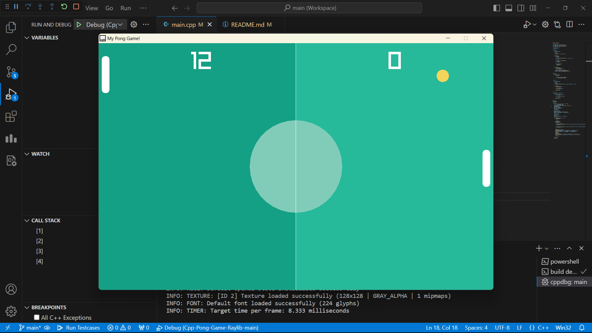
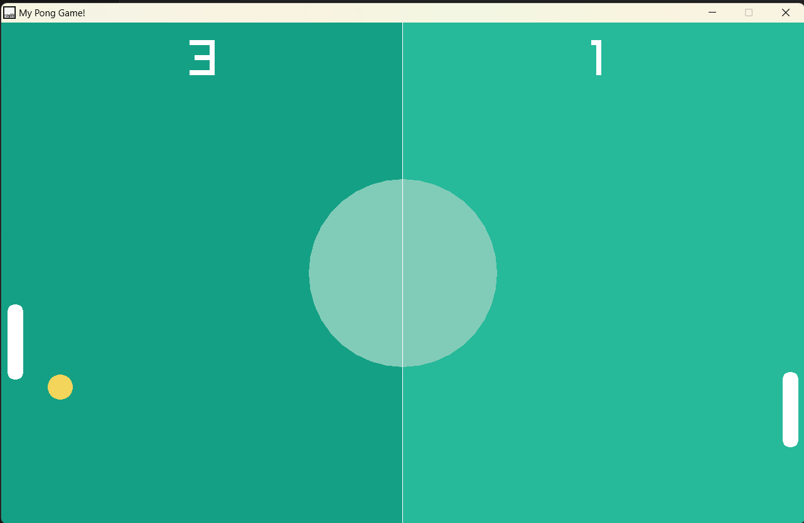
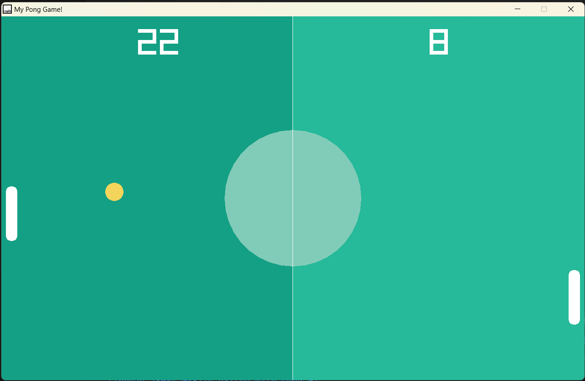

# Pong Game in C++ with Raylib

A classic Pong game implemented in C++ using the Raylib game development library. Enjoy a challenging one-player experience against a CPU opponent.

## Table of Contents

- [Overview](#overview)
- [Features](#features)
- [Prerequisites](#prerequisites)
- [Getting Started](#getting-started)
- [Controls](#controls)
- [Code Structure](#code-structure)
- [Contributing](#contributing)
- [License](#license)

## Overview

This project is a Pong game developed in C++ using the Raylib library. It features a one-player mode against a CPU opponent. Experience classic Pong gameplay with smooth paddle and ball movements, collision detection, and a scoring system.

## Features

- One-player Pong game against a CPU opponent.
- Responsive paddle and ball movements.
- Score tracking for both player and CPU.
- Dynamic ball speed for increased difficulty.
- Basic collision detection.

## Prerequisites

Before running the game, ensure you have the following installed:

- C++ compiler
- Raylib library ([Raylib GitHub](https://github.com/raysan5/raylib))

## Getting Started

1. Clone the repository:

    bash
    git clone https://github.com/your-username/pong-game-cpp-raylib.git
    cd pong-game-cpp-raylib
    

2. Compile the game:

    bash
    g++ main.cpp -o pong -lraylib
    

3. Run the executable:

    bash
    ./pong
    

## Controls

- Player:
    - Move Up: Up Arrow
    - Move Down: Down Arrow

## Game Description

Challenge yourself in this one-player Pong game against a CPU opponent. Test your reflexes and strategic skills as you compete to score against the computer. The CPU adapts its movement to keep the game engaging, and the dynamic ball speed adds an extra layer of difficulty as you progress. Can you beat the CPU and achieve the highest score?

## Code Structure

- main.cpp: Main source code file containing the game logic.
- raylib.h: Header file for the Raylib library.
- Ball class: Represents the game ball.
- Paddle class: Base class for the player's paddle.
- CpuPaddle class: Extends Paddle for the CPU-controlled paddle.
- player, cpu, ball: Objects for player, CPU, and ball.
- Game loop, drawing, and input handling.

## Screenshots

  

  

  

